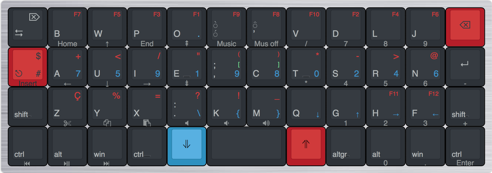

# Optimo

Optimo est une variante du bépo pour les claviers Planck. Le Planck est
un clavier 40%, orthogonal.

# L’essentiel

* Il faut replacer W, Z et M pour avoir toutes les lettres en accès
  direct. 
* Z et W retournent sur leur place de Qwerty, donc à la place de À et É. 
* M s’en va sur l’apostrophe.
* L’apostrophe est replacée sur ^ (qui passe en shift), et les
  accents aigu (direct) et grave (shift) passent sur È.
* ? et ! doivent passer dans les touches indirect du planck (pavé
  auxiliaire?), M et Z respectivement.
* Ç s’obtient par touche morte et l’espace fine insécable va sur la
  place libérée de cette touche.
* L’espace restant est utilisé par \ { } et \_.

# Optimo + : pour le Planck

* La rangée des chiffres descend sur la touche de repos, et est
  optimisée vers les index. Les 6 touches du pavé auxiliaire sont
  placées en bas à gauche, et on y accède par Raise (rouge) pour l’accès
  direct et Lower (bleue) pour l’accés shift.
* La couche Adjust, en appuyant à la fois sur Raise et Lower, fournit un
  pavé numérique à droite, et des touches directionnelles à gauche.
* Il y a des flèches directionnelles sous la main gauche, sur la couche
  Lower.

# Optima : pour les claviers décalés 105 touches

# Optimo pour clavier orthogonal, 104 touches

# Idées

* Il reste de l’espace sur la rangée du haut pour la couche Lower, et
  quelques autre endroits.

### Alt-gr + espace = espace :

* Sur le clavier Poker3, notemment, cette combinaison modifie le
  comportement des touches Ctrl et Shift droits, entre autres. 
* Microsoft Keyboard Layout ne fonctionne pas 
* SQL mgmt studio, raccourcit bloquant…

Je n’utilise pas de lettres compliquées, donc je n’ai pas pu voir
l’impact du Optimo+ sur les cas particuliers. Les lettres grecques
semblent bien aller.

