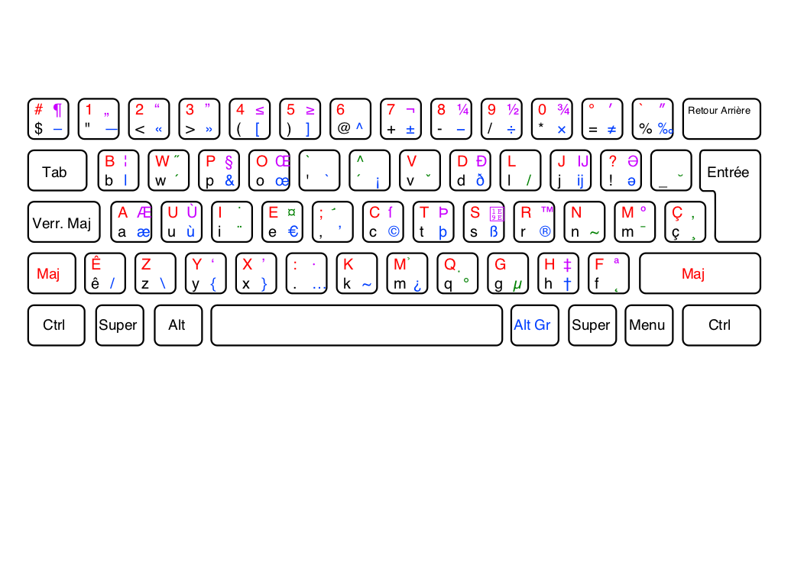
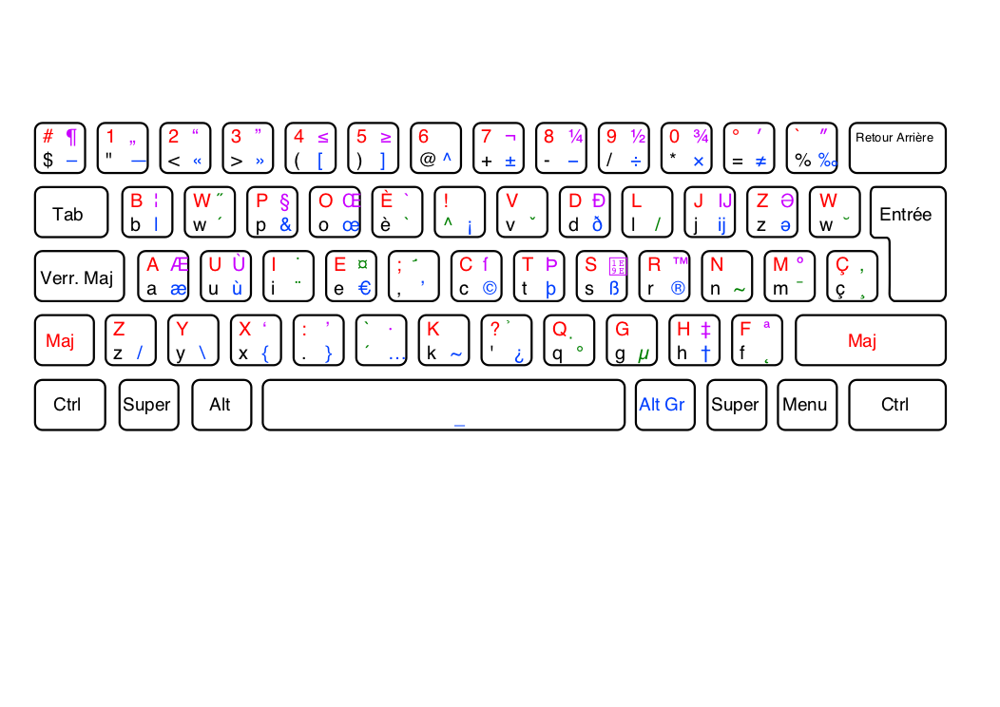

# Sgdjs’ Optimo Keyboards

The Optimo layout is a fork of the [bepo](bepo.fr) keyboard layout with:

* Better availability of W and Z
* Direct access to ´ (dead acute), better access to \` (dead grave)
* Direct or improved access to developer’s characters: <, >, \_, \\,
  no shift insecable space

## Optimo

Optimized layout for orthogonal keyboards of 104 keys

## Optima

Optimized layout with A fingers position, for staggered ISO keyboards

## Installation (Mac and Windows)

### MacOS

Copy the keylayout file in the root or user library, like the ./mac-copy.sh
script does.

### Windows

Unzip the file attached to the tag and launch setup.exe, or do the
manual method:

Download and install the [Microsoft Keyboard Layout Creator](https://msdn.microsoft.com/en-us/globalization/keyboardlayouts)

* Open the file bepo-OptimoB.klc with MKLC.
* Generate the DLL and install program wherever
* Lauch setup.exe

## More

The bepo.fr branch is set to track https://git.tuxfamily.org/dvorak/pilotes.git

Instructions for the tools (French link): http://bepo.fr/wiki/ConfigGenerator
