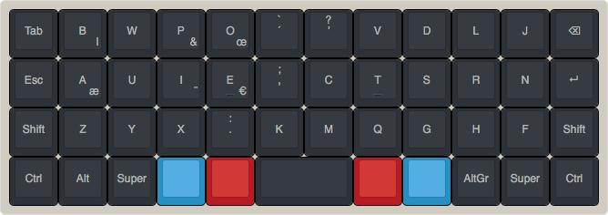
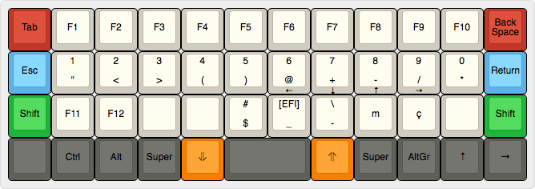
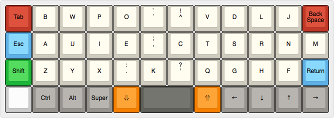
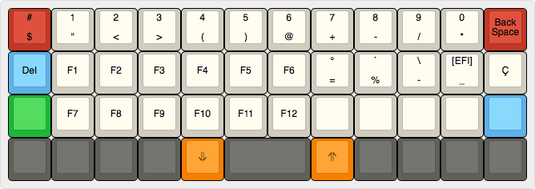

# Optimo 40%

This layout is made for the [Planck](https://olkb.com/planck/) keyboard. It requires changes to the firmware of the keyboard (see more details [below](#optimo-40-default)). It is still a work in progress

- 2 Shift Keys require to move the M to the middle. So far, it is instead of ’ apostrophe, which moves to ^ which itself becomes available with the raise-down buttons.
- Setting paralel Ctrl/Alt keys moves the arrows to the both raise and down at the same time (lock?), to test.
- These changes have to be tested; the free keys in the thumb row could add one or two more layers, and the RD layer has a free key too. Caps lock pressing both shift.

## Optimo 40% Default

The optimo layout might be usable as is on a Planck keyboard, but it has features incompatible with the basic ergonomics stated by bepo:

* Alternate use of Right and Left shift
* Numbers and symbols at the top row of the raise-down layer
* No AltGr

So it might be possible to get over it with habit, but it might not and requires testing.

The Raise-Down layer (what is the official name of this layer)

