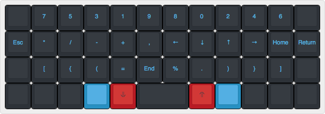
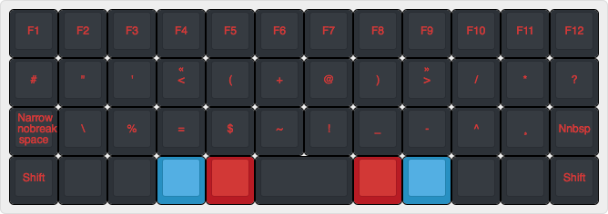

# Optimo 40%

This layout is for the [Planck](https://olkb.com/planck/) keyboard. 
    
The development of the following firmware has not started yet.

This layer is obtained by pressing the two blues together:

## Optimo 40% Default

The optimo layout might be usable as is on a Planck keyboard, but it has features incompatible with the basic ergonomics stated by bepo:

* Alternate use of Right and Left shift
* Numbers and symbols at the top row of the raise-down layer
* No AltGr

So it might be possible to get over it with habit, but it might not and requires testing.

The Raise-Down layer (what is the official name of this layer)

